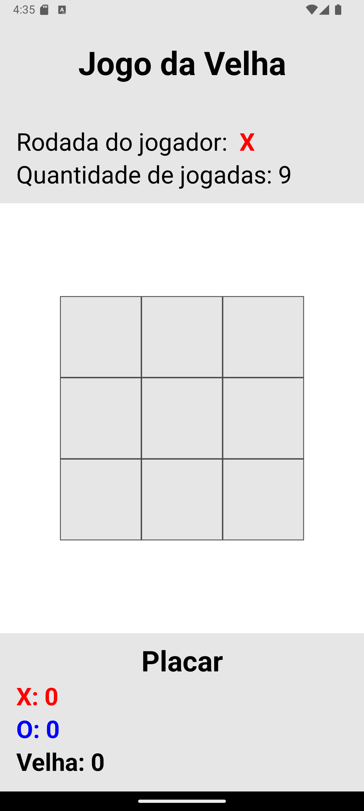
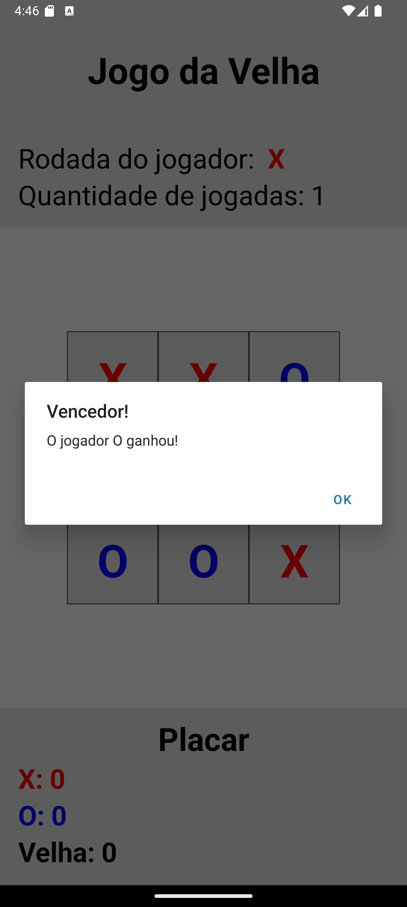

# Jogo da Velha (Tic-Tac-Toe) - React Native

## Descrição

Este projeto é uma implementação do clássico jogo da velha (Tic-Tac-Toe) usando React Native e Expo. O jogo permite que dois jogadores alternem jogadas e tenta vencer ou empatar o jogo. O placar é mantido e exibido na tela, mostrando a quantidade de vitórias para cada jogador e empates.

## Visualização

 
 

